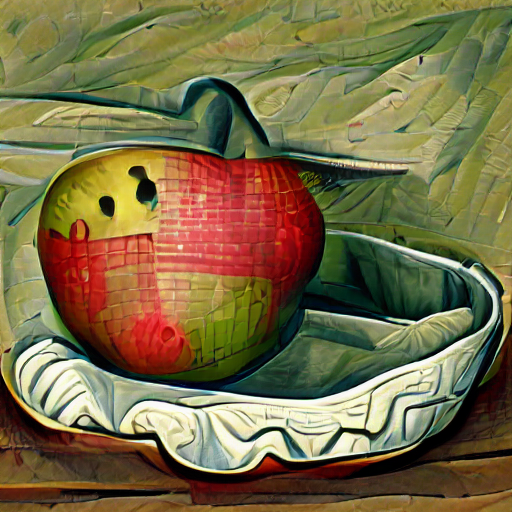
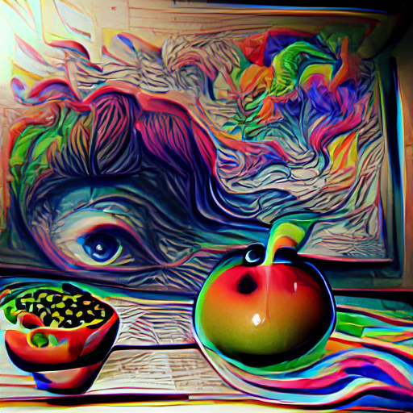

# VQGAN-CLIP And Sdvm

full Notebooks also Avaliable on notebook folder

notebooks: [![Open In Colab][colab-badge]][colab-notebook]

[colab-notebook]: <https://colab.research.google.com/drive/1Beuy31ZtlXSNyttNXfz_oq9US-8r2M0k?usp=sharing>
[colab-badge]: <https://colab.research.google.com/assets/colab-badge.svg>

[colab-notebook]: <https://colab.research.google.com/github/pollinations/hive/blob/main/notebooks/2%20Text-To-Video/1%20CLIP-Guided%20VQGAN%203D%20Turbo%20Zoom.ipynb>
[colab-badge]: <https://colab.research.google.com/assets/colab-badge.svg>

<div align=center>

 
</div>  

<div align=center>

 
</div> 


## Set up

Install Pytorch in the new enviroment:

```sh
pip install torch==1.9.0+cu111 torchvision==0.10.0+cu111 torchaudio==0.9.0 -f https://download.pytorch.org/whl/torch_stable.html
```

Install other required Python packages:

```sh
pip install ftfy regex tqdm omegaconf pytorch-lightning IPython kornia imageio imageio-ffmpeg einops torch_optimizer setuptools==59.5.0
```

Or use the ```requirements.txt``` file, which includes version numbers.

Clone required repositories:

```sh
git clone 'https://github.com/nerdyrodent/VQGAN-CLIP'
cd VQGAN-CLIP
git clone 'https://github.com/openai/CLIP'
git clone 'https://github.com/CompVis/taming-transformers'
```

```sh
mkdir checkpoints

curl -L -o checkpoints/vqgan_imagenet_f16_16384.yaml -C - 'https://heibox.uni-heidelberg.de/d/a7530b09fed84f80a887/files/?p=%2Fconfigs%2Fmodel.yaml&dl=1' #ImageNet 16384
curl -L -o checkpoints/vqgan_imagenet_f16_16384.ckpt -C - 'https://heibox.uni-heidelberg.de/d/a7530b09fed84f80a887/files/?p=%2Fckpts%2Flast.ckpt&dl=1' #ImageNet 16384
```
Note that users of ```curl``` on Microsoft Windows should use double quotes.

The `download_models.sh` script is an optional way to download a number of models. By default, it will download just 1 model.

See <https://github.com/CompVis/taming-transformers#overview-of-pretrained-models> for more information about VQGAN pre-trained models, including download links.

By default, the model .yaml and .ckpt files are expected in the `checkpoints` directory.
See <https://github.com/CompVis/taming-transformers> for more information on datasets and models.


## Run

To generate images from text, specify your text prompt as shown in the example below:

```sh
python generate.py -p "A painting of an apple in a fruit bowl"
```

</img>

## Multiple prompts

Text and image prompts can be split using the pipe symbol in order to allow multiple prompts.
You can also use a colon followed by a number to set a weight for that prompt. For example:

```sh
python generate.py -p "A painting of an apple in a fruit bowl | psychedelic | surreal:0.5 | weird:0.25"
```

</img>


